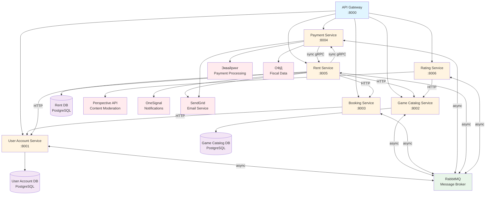

# University Microservices

A microservices-based game rental and booking system built with Python and FastAPI.

## Services

- **Gateway** (port 8000) - API Gateway
- **User Account** (port 8001) - User management and authentication
- **Game Catalog** (port 8002) - Game catalog management
- **Booking** (port 8003) - Game booking service
- **Payment** (port 8004, gRPC 50051) - Payment processing
- **Rent** (port 8005) - Game rental management
- **Rating** (port 8006) - Rating and review service

## Architecture



## Prerequisites

- Docker and Docker Compose
- [uv](https://docs.astral.sh/uv/) (Python package manager)

## Quick Start

### Start all services

```bash
docker-compose up -d
```

### Access services

- API Gateway: <http://localhost:8000>
- RabbitMQ Management: <http://localhost:15672> (guest/guest)
- User Account DB: localhost:5433
- Game Catalog DB: localhost:5434
- Rent DB: localhost:5435

### Stop services

```bash
docker-compose down
```

## Project Structure

```text
code/
  services/            # Microservices
  rabbitmq/            # RabbitMQ examples
  pyproject.toml       # Workspace configuration
  docker-compose.yml   # Orchestration of all services
```

## Development

Each service has its own `pyproject.toml` and can be run independently. Pre-commit hooks are configured with Ruff for linting and formatting. Install them using `prek install`
